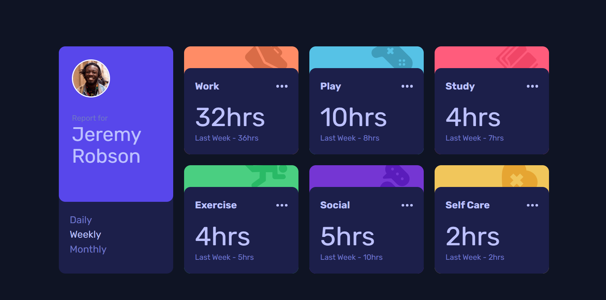

# Frontend Mentor - Time tracking dashboard solution

This is a solution to the [Time tracking dashboard challenge on Frontend Mentor](https://www.frontendmentor.io/challenges/time-tracking-dashboard-UIQ7167Jw). Frontend Mentor challenges help you improve your coding skills by building realistic projects. 

## Table of contents

- [Overview](#overview)
  - [The challenge](#the-challenge)
  - [Screenshot](#screenshot)
  - [Links](#links)
- [My process](#my-process)
  - [Built with](#built-with)
  - [What I learned](#what-i-learned)
  - [Continued development](#continued-development)
  - [Useful resources](#useful-resources)
- [Author](#author)
## Overview

### The challenge

Users should be able to:

- View the optimal layout for the site depending on their device's screen size
- See hover states for all interactive elements on the page
- Switch between viewing Daily, Weekly, and Monthly stats

### Screenshot

### Links

- Solution URL: [Add solution URL here](https://your-solution-url.com)
- Live Site URL: [https://kirlosbasta.github.io/time-tracking-dashboard/](https://kirlosbasta.github.io/time-tracking-dashboard/)

## My process

### Built with

- Semantic HTML5 markup
- Flexbox
- CSS Grid
- Mobile-first workflow
- Tailwind CSS
- [React](https://reactjs.org/) - JS library

### What I learned

I learned how to deploy a React app using GitHub Pages.

### Continued development

to improve my skills in React and Tailwind CSS. I also want to learn more about state management in React, especially using libraries like Redux or Context API.
I plan to work on more projects that involve complex state management and data fetching to solidify my understanding of these concepts.
I also want to explore more advanced CSS techniques and frameworks to enhance my styling skills.
I want to learn more about accessibility in web development and how to make my projects more inclusive for all users. I plan to read more about ARIA roles and best practices for accessible design.

### Useful resources

- [Deploy using GitHub pages](https://youtu.be/Bk28snjHr7c?si=-CVH8bDlKKIonUWD) - This helped me for deploying my React app using GitHub Pages. I learned how to set up the project for deployment and how to configure the GitHub repository for hosting.
- [React documentation](https://react.dev/learnl) - This is the official React documentation. It helped me understand the core concepts of React and how to use them effectively in my projects.
- [Tailwind CSS documentation](https://tailwindcss.com/docs) - This is the official Tailwind CSS documentation. It helped me understand how to use Tailwind CSS classes and utilities to style my components effectively.

## Author

- Frontend Mentor - [@kirlosbasta](https://www.frontendmentor.io/profile/kirlosbasta)
- GitHub - [@kirlosbasta](https://github.com/kirlosbasta)
